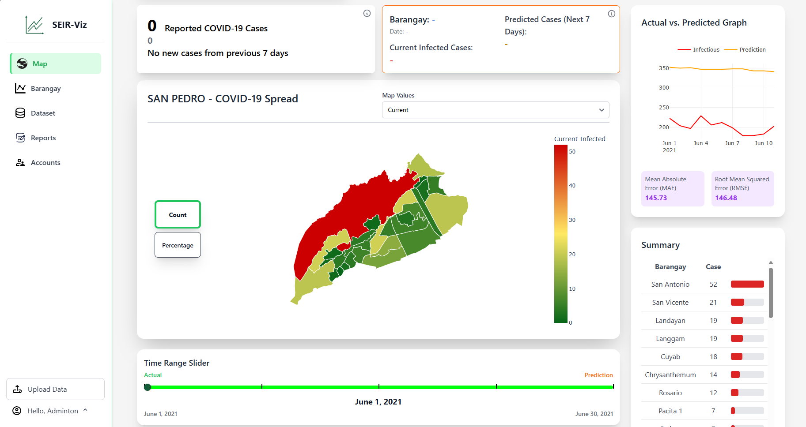
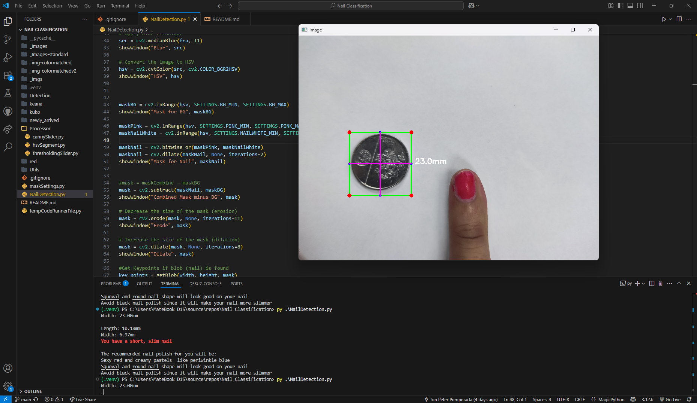
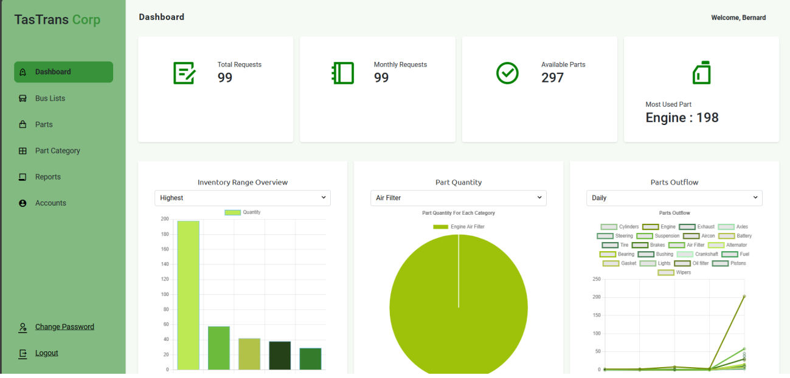
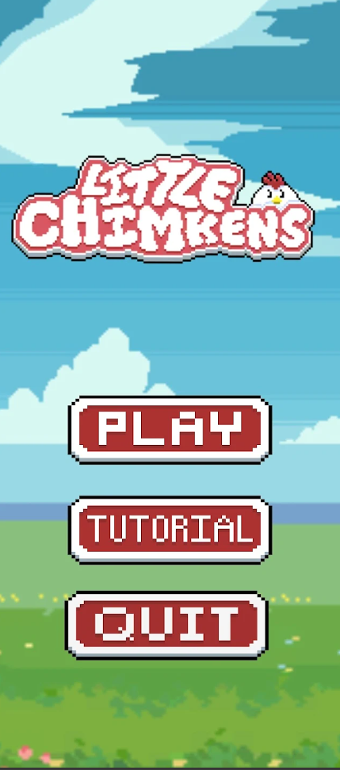

# Mapua MCL Projects — Course & Thesis Projects

A curated list of course, module, and thesis projects by Jon Peter Pomperada (JonPeterP).
This repository aggregates links, short descriptions, and screenshots so you can quickly browse my work.

## Projects

Below are the main projects included in this collection. Click the project name to open its repository.

- **SEIR-Viz** — CS Thesis (2024–2025)
  - Repo: https://github.com/JonPeterP/SEIR-Viz
  - Languages: HTML (97.3%), Python (2.7%)
  - Screenshot:
    

- **Nail-Classification**
  - Repo: https://github.com/JonPeterP/Nail-Classification
  - Languages: Python (100%)
  - Screenshot:
    

- **TasTrans-BPIMS** — Bus Parts Inventory Management System
  - Repo: https://github.com/JonPeterP/TasTrans-BPIMS
  - Languages: HTML (34.2%), C# (34.1%), CSS (31.7%)
  - Screenshot:
    

- **Little Chimken** — Game Development (IT174P)
  - Repo: https://github.com/JonPeterP/LittleChimken
  - Languages: C#, HTML, ShaderLab, PHP, Mathematica, HLSL
  - Screenshot:
    

- **PresidentFaceReco** — Midterm (CS124P)
  - Repo: https://github.com/JonPeterP/PresidentFaceReco
  - Languages: Jupyter Notebook (100%)

- **NarutoGame-IT173P** — Module project
  - Repo: https://github.com/JonPeterP/NarutoGame-IT173P
  - Languages: Java (100%)

